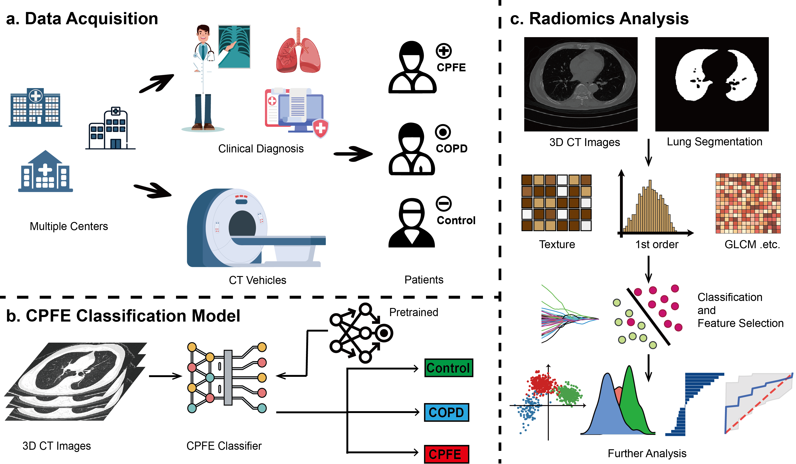

# CPFENET
## Harnessing Artificial Intelligence for Accurate Diagnosis and Radiomics Analysis of Combined Pulmonary Fibrosis and Emphysema: Insights from a Multicenter Cohort Study

[](https://www.medrxiv.org/content/10.1101/2025.01.20.25320811v1)

__Shichen Zhang†, Hongqiu Wang†, Haiyun Tang†, Xiaoqin Li†, Nian-Wei Wu†, Bo Li, Xin Chen, Kaishi Chen, Baosong Xie\*,, Aiyuan Zhou\*,, Chunheng Mo\*__\
\* To whom correspondence should be addressed.  
†These authors contributed equally to this work.\

## Abstract
Combined Pulmonary Fibrosis and Emphysema (CPFE), formally recognized as a distinct pulmonary syndrome in 2022, is characterized by unique clinical features and pathogenesis that may lead to respiratory failure and death. However, the diagnosis of CPFE presents significant challenges that hinder effective treatment. Here, we assembled three-dimensional(3D) reconstruction data of the chest High-Resolution Computed Tomography（HRCT) of patients from multiple hospitals across different provinces in China, including Xiangya Hospital, West China Hospital, and Fujian Provincial Hospital. Using this dataset, we developed CPFENet, a deep learning-based diagnostic model for CPFE. It accurately differentiates CPFE from COPD, with performance comparable to that of professional radiologists. Additionally, we developed a CPFE score based on radiomic analysis of 3D CT images to quantify disease characteristics. Notably, female patients demonstrated significantly higher CPFE scores than males, suggesting potential sex-specific differences in CPFE. Overall, our study establishes the first diagnostic framework for CPFE, providing a diagnostic model and clinical indicators that enable accurate classification and characterization of the syndrome. 




COPYRIGHT NOTICE: This image is protected by copyright laws and is the property of Chunheng Mo, Sichuan University. Unauthorized copying, distribution, or use of this image is strictly prohibited. All rights reserved.

## Model architecture
The model architecture is included in the manuscript and will not be displayed before the article is published.
## Install

This project uses requirements.txt.

```sh
$ pip install -r requirements.txt
```
## Run the CPFENet
The project can be reproduction with the 3D CT image dataset, whose input type should be 3D dicom type.

```sh
import torch
from model.ensemble import CPFENet

model = CPFENet( input_w = 128,
                 input_h = 128,
                 input_d = 128,
                 input_channel = 1,
                 CNN_shortcut_type = 'B',
                 CNN_fc_input = 512,
                 transformer_patch_size = [2, 4, 4],
                 transformer_patch_embedding_dim = 96,
                 module_outdim = 32,
                 output_dim = 3)

# CPFENet can accept the input of the torch tensor with the format of (Batch size, Channel, Width, Height, Depth), which represent the format of a 3D image

input_demo = torch.randn((32,1,128,128,128))
model(input_demo)

# Also you can make your dataset based on the CTDataset class as shown in the dataset.py, which can be used as follows:

>>> from dataset import CTDataset
>>> data_path = ''
>>> ct_dataset = CTDataset("data_path", input_w=128, input_d=128, input_h=128, threeD=True)

# then you can transform them into the dataloader and do the training

from train import train_image 
from torch.utils.data import DataLoader

# Set hyperparameters
batch_size = 32
num_epoch = 300
lr = 1e-5
lr_min = 0
gpu_ids = [0, 1, 2, 3]  # Use GPUs 0, 1, 2, 3
device = torch.device(f'cuda:{gpu_ids[0]}' if torch.cuda.is_available() else 'cpu')

# make dataloader
train_size = int(len(ct_dataset) * 0.7)
test_size = len(ct_dataset) - train_size 
train_dataset, test_dataset = torch.utils.data.random_split(ct_dataset, [train_size, test_size])
train_loader = DataLoader(train_dataset, batch_size=batch_size, shuffle=True)
test_loader = DataLoader(test_dataset, batch_size=batch_size)

# Start training
train_losses, train_acces, eval_losses, eval_acces, eval_auces = train_image(
    model, loss_fn, train_loader, test_loader, gpu_ids, batch_size,
    num_epoch, lr, lr_min, init=True
)
```

## Reference
All references are listed in the article.

# Citation

If you find our work useful or relevant to your research, please consider citing:
```
@article {Zhang2025.01.20.25320811,
	author = {Zhang, Shichen and Wang, Hongqiu and Tang, Haiyun and Li, Xiaoqin and Wu, Nian-Wei and Li, Bo and Chen, Xin and Chen, Kaishi and Xie, Baosong and Zhou, Aiyuan and Mo, Chunheng},
	title = {Harnessing Artificial Intelligence for Accurate Diagnosis and Radiomics Analysis of Combined Pulmonary Fibrosis and Emphysema: Insights from a Multicenter Cohort Study},
	elocation-id = {2025.01.20.25320811},
	year = {2025},
	doi = {10.1101/2025.01.20.25320811},
	URL = {https://www.medrxiv.org/content/early/2025/01/20/2025.01.20.25320811},
	eprint = {https://www.medrxiv.org/content/early/2025/01/20/2025.01.20.25320811.full.pdf},
	journal = {medRxiv}
}

```
## Licence
The code is distributed under the Apache License 2.0.
